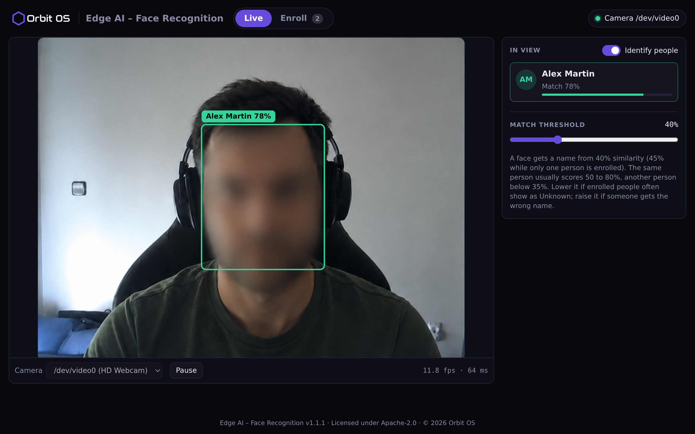
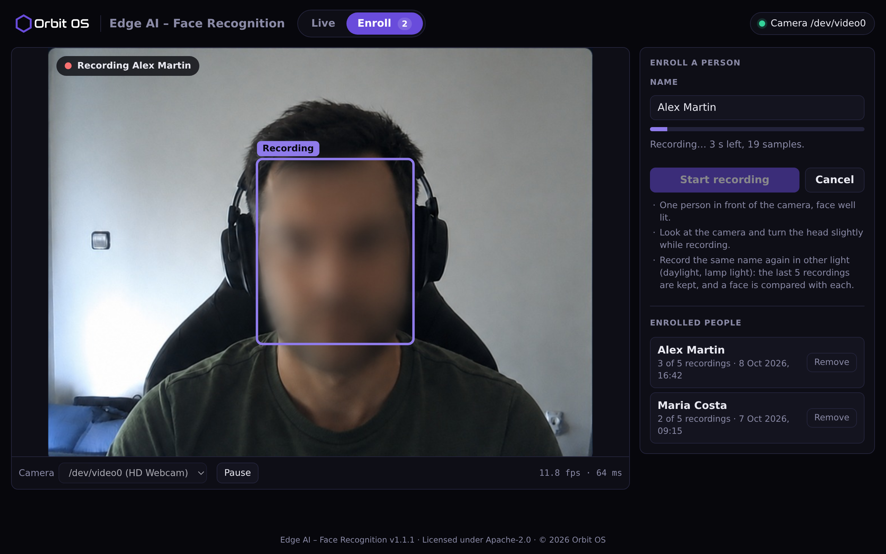

<p align="center">
  
</p>

<h1 align="center">Edge AI – Face Recognition for Orbit OS</h1>

<p align="center"><b>Detect and recognise faces from a camera, live, on the device — an example of the Orbit OS Camera and AI APIs working together.</b></p>

An [Orbit OS](https://www.orbit-os.org/?ref=github-face-recognition) app that watches a camera, finds the faces in each frame and tells you who they are. Enroll a person by typing a name and recording their face for five seconds; from then on the app shows the name next to the face, live in the browser. Everything runs **locally on the device** through the Orbit OS AI service — no cloud API, and the faces you enroll stay on the device.

It is also a complete, readable example of **Edge AI on Orbit OS**: a camera stream, two models chained together (one TensorFlow Lite, one ONNX) and a web page, built with the [Orbit OS Go SDK](https://github.com/OrbitOS-org/orbit-os-sdk-go).

Runs on Raspberry Pi 3 / 4 / 5 and Arduino UNO Q with Orbit OS (free Community Edition) and a USB camera.

<p align="center">
  
</p>

## Features

- **Live view** — the camera in the browser, with a box and a name on each face, drawn as the faces move
- **Recognise people by name** — or switch *Identify people* off to only find faces
- **Enroll in seconds** — type a name, press *Start recording* and look at the camera for five seconds
- **Several recordings for each person** — record the same name again in other light (daylight, lamp light); the last five recordings are kept and a face is compared with each of them
- **Match threshold on the page** — a slider sets how similar a face must be to get a name; the choice is kept
- **On-device inference** through the Orbit OS AI service (TFLite and ONNX) — frames never leave the device
- **Models included** — both models ship inside the app, so it works right after install
- **Light on the device** — faces are found on every frame, but a face is identified only when it appears and again from time to time, not on every frame
- **Choose the camera** when the device has more than one, and **pause** it when you do not need it
- **Manage enrolled people** — see who is enrolled and remove them from the page
- Works on a phone

<p align="center">
  
</p>

## Install

**From the Orbit OS Store (recommended):** install [Edge AI – Face Recognition](https://store.orbit-os.org/app/face-recognition-client?ref=github-face-recognition) on your device in one click.

<a href="https://store.orbit-os.org/app/face-recognition-client?ref=github-face-recognition"></a>

**From source — recommended: [Orbit Studio](https://marketplace.visualstudio.com/items?itemName=orbit-os.orbit-studio) (VS Code):**

You need [VS Code](https://code.visualstudio.com/) with the Orbit Studio extension and **[Go](https://go.dev/dl/) 1.25 or newer** installed (`go` on your PATH).

1. Clone the repository and open the folder in VS Code with the Orbit Studio extension:
   ```bash
   git clone https://github.com/OrbitOS-org/orbit-os-app-face-recognition
   code orbit-os-app-face-recognition
   ```
2. In the Orbit sidebar, run **Add / Update SDK** and set your device's IP.
3. Use **Run** to try it live against a device in Developer Mode, then **Build + Deploy** to install the signed `.orb`.

**Without Orbit Studio:** unpack the [SDK release](https://github.com/OrbitOS-org/orbit-os-sdk-go/releases/tag/v26.0.3) into `orbit-os-sdk-go/`, then `go build ./cmd/face_recognition_client` builds the binary — use Orbit Studio to package and sign the `.orb`.

## Getting started

1. Connect a USB camera to the device.
2. Open **Edge AI – Face Recognition** from the AppHub on your device. The live view starts and faces are framed as they appear.
3. Open **Enroll**, type the person's name, press **Start recording** and keep the face in view for five seconds.
4. Back in **Live**, the name and the match score appear next to the face.

## Models

The app ships with two models, in [`cmd/face_recognition_client/orb/data/`](cmd/face_recognition_client/orb/data/). Orbit Studio packages everything under `orb/data/` into the `.orb`.

| Model | File | What it does |
|---|---|---|
| **BlazeFace** (full range), from [MediaPipe](https://github.com/google-ai-edge/mediapipe) — TensorFlow Lite, Apache-2.0 | `blaze_face_full_range.tflite` | finds the faces in the frame and, for each, the eyes, the nose and the mouth |
| **SFace**, from the [OpenCV Zoo](https://github.com/opencv/opencv_zoo/tree/main/models/face_recognition_sface) — ONNX, quantised version (10 MB instead of 39 MB), Apache-2.0 | `face_recognition_sface_2021dec_int8.onnx` | turns a face into a list of 128 numbers (an embedding) that can be compared with others |

### How well it tells people apart

Measured with these two models and the app's own code for preparing the pictures (detection decoding, alignment), on 1,000 pairs of the public [LFW](http://vis-www.cs.umass.edu/lfw/) set — half of them two pictures of the same person, half two different people:

| Match threshold | Different people given a name | Same person recognised |
|---|---|---|
| 30% | 0.6% | 99.6% |
| **40% (default)** | **none of 498** | **98.2%** |
| 50% | none of 498 | 94.0% |

Two pictures of the same person scored 66% on average; two different people, 8% (the highest was 32%). The figures above are for the full-size model; on the whole LFW list (5,970 pairs) the full-size model was right for 99.50% of the pairs and the quantised one shipped here for 99.47%. These are pictures taken on different occasions; in front of a fixed camera the same person usually scores higher. People who look alike, such as close relatives, can score higher than strangers do — enroll them both, so that the app can tell them apart, and raise the threshold if needed.

## How it works

For each camera frame:

1. **Detect** — the frame is scaled to the 192×192 input of BlazeFace, keeping its proportions (black bars fill the rest). The model returns a box and keypoints for every face.
2. **Follow** — each face keeps its number from one frame to the next, so the app knows which faces it has already identified.
3. **Align** — the face is rotated and scaled so that the eyes, the nose and the mouth land on fixed positions.
4. **Embed** — SFace turns the aligned face into an embedding.
5. **Match** — the embedding is compared (cosine similarity) with every recording of every enrolled person; a person counts with the closest one. A name is shown only when the best match is above the threshold and clearly ahead of the second best person; otherwise the face is *Unknown*. While only one person is enrolled there is nobody to tell that person apart from, so the threshold is higher.

Steps 3 to 5 are the costly part and run only when needed: when a face appears, about once a second after that (more often while it is still unknown), and during an enrollment. With *Identify people* off, only step 1 runs.

The page shows the camera frames as they arrive and draws the boxes itself, from the results of the last frame analysed — the device does not redraw or recompress the video.

Each recording is stored as the average of the embeddings taken during it, not as pictures. When an update changes the model or how a face is prepared, earlier recordings can no longer be compared: the person stays in the list, marked to be recorded again.

| File | What |
|---|---|
| `main.go` | start-up |
| `config.go` | defaults and settings (camera, models, thresholds) |
| `face_client.go` | camera stream, frame loop, enrollment |
| `pipeline.go` | detection, face following, alignment and embedding; `pipeline_test.go` tests them without a device |
| `recognition.go` | matching an embedding against the enrolled people |
| `embeddings_store.go` | the enrolled people and their recordings, saved as a JSON file |
| `settings.go` | the match threshold chosen on the page |
| `webui.go`, `web/static/` | web page and its HTTP API |

## Development (Orbit Studio)

This project follows the standard [Orbit Studio](https://marketplace.visualstudio.com/items?itemName=orbit-os.orbit-studio) layout:

| Path | What |
|---|---|
| `cmd/face_recognition_client/` | app source, `metadata.json` (manifest & permissions) |
| `cmd/face_recognition_client/orb/icon.svg` | launcher / Store icon |
| `cmd/face_recognition_client/orb/data/` | the models packaged into the `.orb` |
| `orbit.project.json` | Orbit Studio project settings |

- **Recommended workflow:** open the folder in VS Code with Orbit Studio, **Add / Update SDK** (downloads the SDK into `orbit-os-sdk-go/`, which is not in the repository), then **Run** to develop against a device in Developer Mode, or **Build + Deploy** to install the `.orb`.
- The project builds against that local SDK copy (`go.mod` and `go.work` point to it).
- Development TLS certificates live in `cmd/certs/grpc/` and are never committed.
- `go test ./cmd/face_recognition_client` runs the tests of the pipeline, the matching and the people file (no device needed).
- Permissions used: `CameraService`, `AiService`, `AppHubService`, `SystemService`.

Settings can be changed with environment variables when running off-device (development):

| Variable | Default | What |
|---|---|---|
| `ORBIT_GRAVITY_TCP_HOST` | `192.168.1.100` | IP of the device (development only; on the device the SDK connects locally) |
| `FACE_CAMERA_DEVICE_ID` | `/dev/video0` | camera |
| `FACE_CAMERA_FPS` | `15` | camera frames per second |
| `FACE_CAMERA_WIDTH` / `FACE_CAMERA_HEIGHT` | `640` / `480` | frame size |
| `FACE_MAX_FACES` | `2` | faces handled in one frame |
| `FACE_MATCH_THRESHOLD` | `0.40` | lowest similarity accepted as a match (0–1), until it is changed on the page |
| `FACE_SINGLE_PERSON_THRESHOLD` | `0.45` | the same, while only one person is enrolled; it stays this far above the match threshold |
| `FACE_SECOND_BEST_MARGIN` | `0.08` | how far ahead of the second best the match must be |
| `FACE_ENROLL_DURATION_SECONDS` | `5` | length of an enrollment recording |
| `FACE_EMBEDDINGS_FILE` | `face_db/embeddings.json` | where the enrolled people are saved |
| `FACE_WEBUI_LISTEN` | *(automatic)* | address of the web page; leave it unset on a device (`127.0.0.1` and a port from 50000–60000) |
| `FACE_WEBUI_ROUTE` | `/face-recognition` | path of the page in the AppHub |

## Privacy and security

- **Everything stays on the device.** Camera frames are processed locally and are not stored. Enrolled people are saved as a name and embeddings in `face_db/embeddings.json`, in the app's data folder on the device, readable by the app only; no pictures are kept, and the embeddings are never sent to the browser.
- **Face data is personal data.** Enroll only people who agreed to it, and follow the rules that apply where you use the app.
- The page listens on `127.0.0.1` only and is reached through the Orbit OS AppHub at `http://<DEVICE_IP>/face-recognition`, behind the device login. It is not reachable directly from the network.
- The app takes a port in the reserved range 50000–60000 (starting at 50004) and moves to the next one when a port is taken. If it cannot open its page it stops, instead of running without one.
- When the app is stopped it takes its page off the AppHub and frees the camera.

## Links

[App in the Store](https://store.orbit-os.org/app/face-recognition-client?ref=github-face-recognition) · [Orbit OS](https://www.orbit-os.org/?ref=github-face-recognition) · [Getting started](https://www.orbit-os.org/getting_started.html?ref=github-face-recognition) · [SDK reference](https://www.orbit-os.org/api-reference.html?ref=github-face-recognition) · [Forum](https://forum.orbit-os.org/?ref=github-face-recognition) · info@orbit-os.org

## Acknowledgments

Face detection uses the **BlazeFace** model from **[MediaPipe](https://github.com/google-ai-edge/mediapipe)** by Google. Face recognition uses **[SFace](https://github.com/zhongyy/SFace)** by Yaoyao Zhong and co-authors, in the ONNX version published in the **[OpenCV Zoo](https://github.com/opencv/opencv_zoo)**. Thanks to both teams for publishing them.

## License

Apache-2.0 — see [LICENSE](LICENSE) and [NOTICE](NOTICE).
